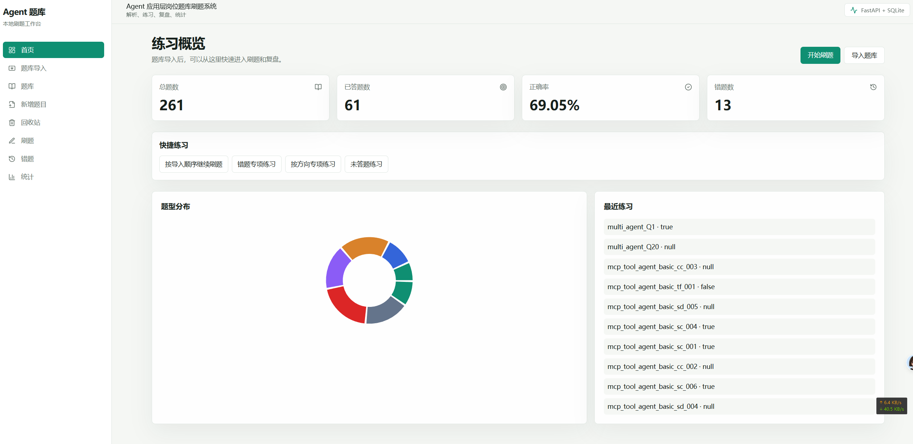
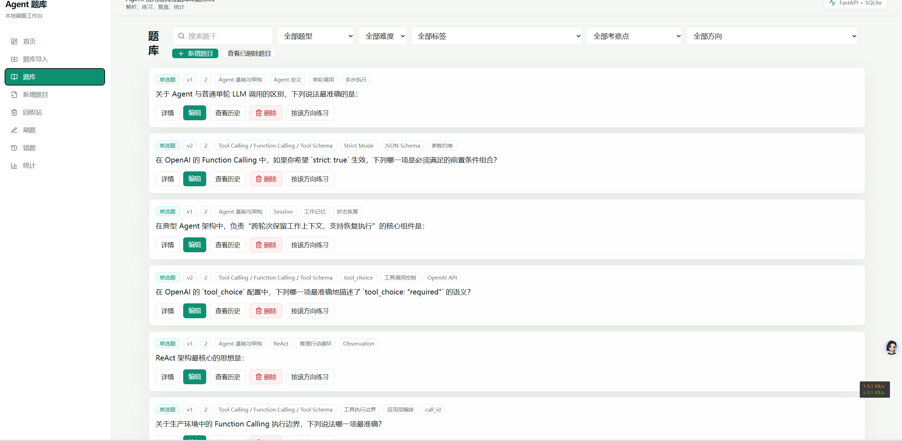
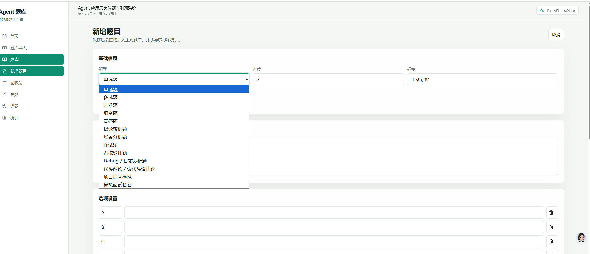
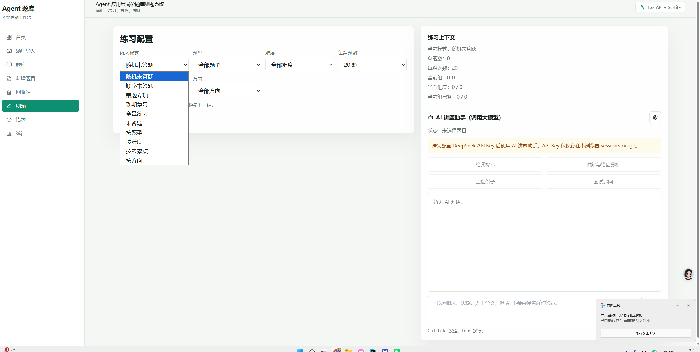
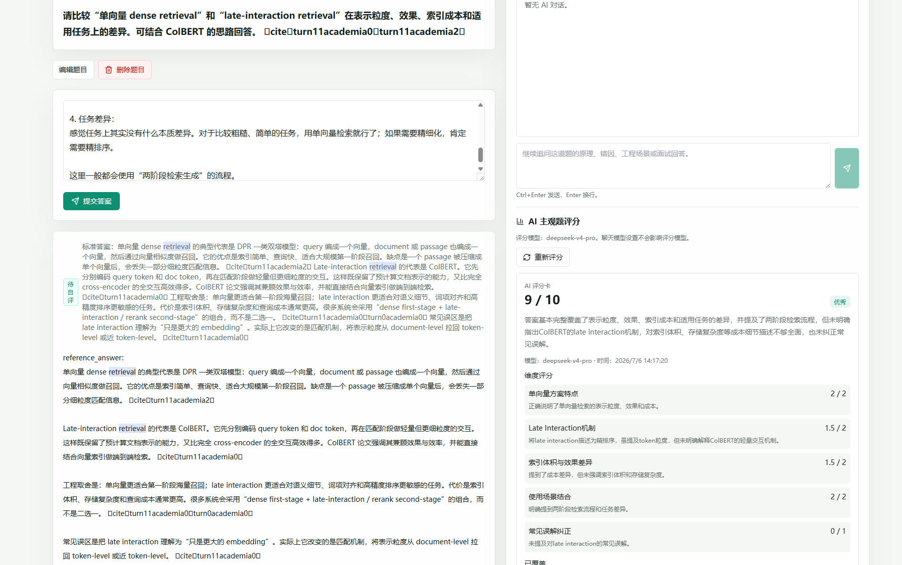
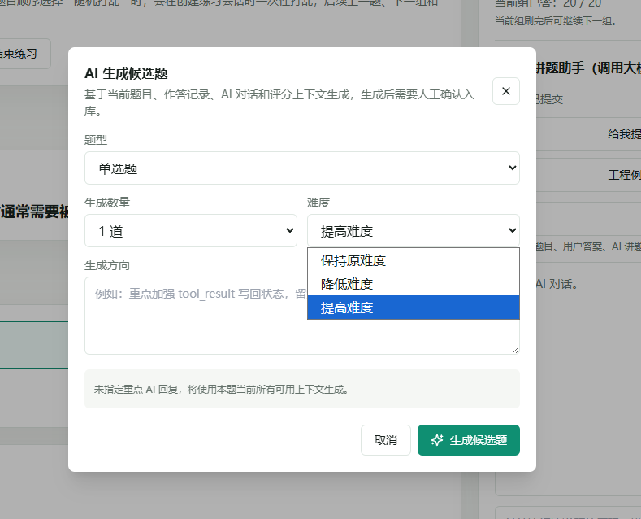
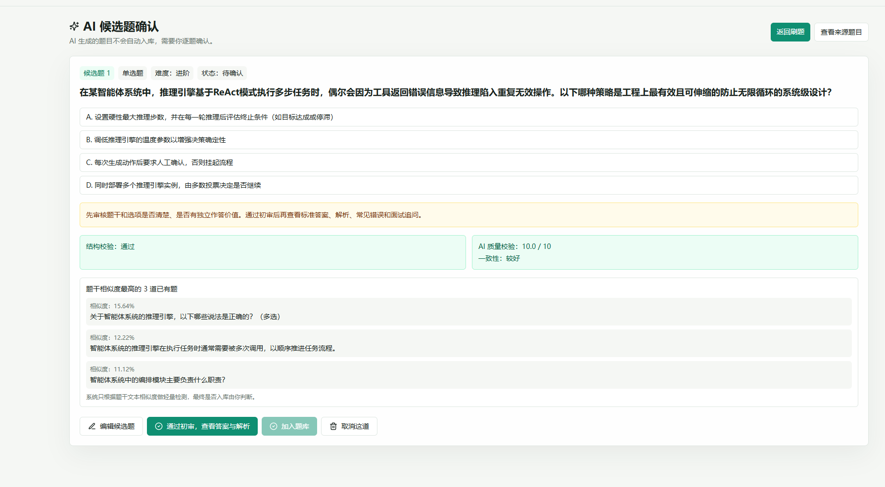
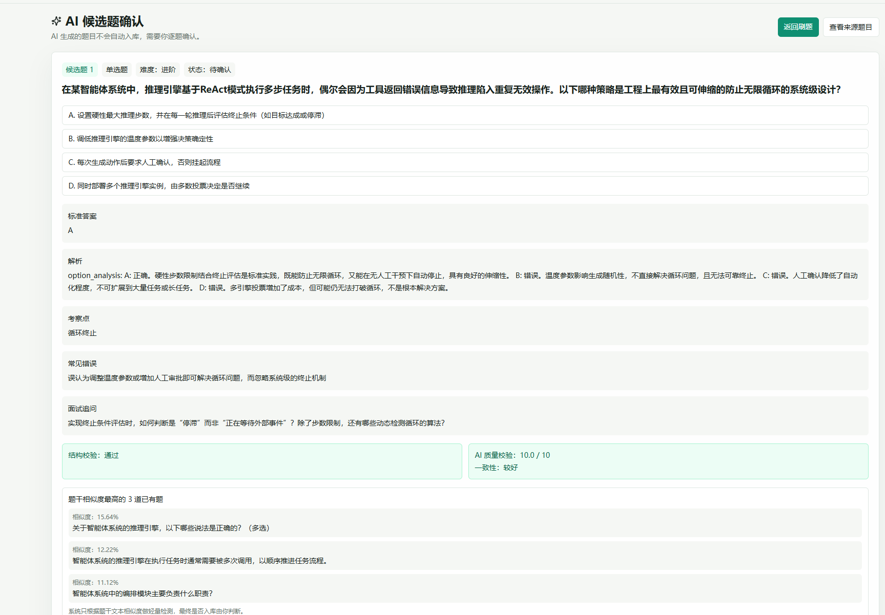
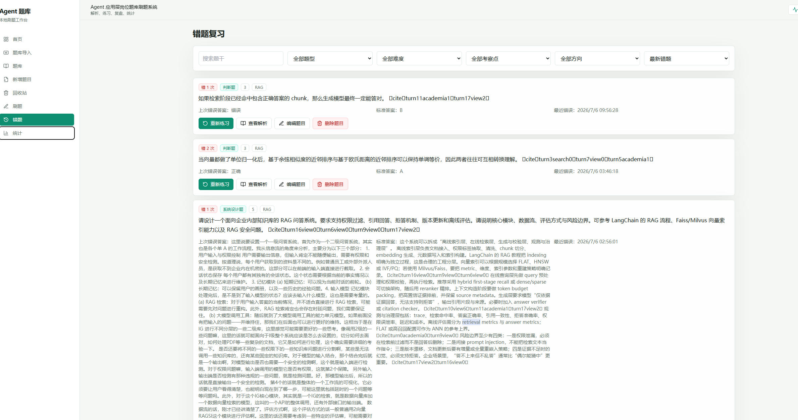
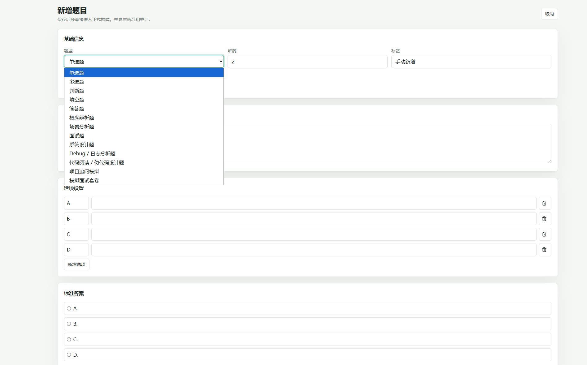

# Exercise Question System

面向个人知识复盘和面试准备的本地题库刷题系统。项目最初的目标很直接：把自己整理的面试题、理论题、工程场景题沉淀成可反复练习的题库，而不是只停留在 Markdown 笔记里；通过答题、纠错、错题复习和 AI 辅助讲解，把“看过”变成“真正能说清楚、答完整、能复盘”。

当前题库重点围绕 Agent 应用层岗位能力展开，包括 MCP / Tool 协议、RAG、Multi-Agent、安全、评估、工具调用、系统设计和工程排障等方向。

## 项目初衷

很多技术知识只看文档或笔记时容易产生“我懂了”的错觉，但面试或工程讨论时真正困难的是：

- 能不能在没有提示的情况下独立回答。
- 能不能把概念讲成结构化答案。
- 能不能发现自己答漏了哪些关键点。
- 能不能把错题、模糊点和 AI 追问沉淀成下次复习的摘要。
- 能不能把主观题答案从“差不多懂”打磨到“面试可讲、工程可落地”。

所以这个系统不是一个简单的题库列表，而是一个本地学习闭环：

```text
Markdown 题库
  -> 结构化导入
  -> 分模式练习
  -> 自动判分 / 主观题评分
  -> 错题与历史记录
  -> AI 讲解、评分追问、学习摘要
  -> 再次练习
```

## 核心亮点

### 1. Markdown 题库结构化导入

支持将个人维护的 Markdown 题库解析成结构化题目，写入 SQLite。适合先用文档快速沉淀内容，再导入系统进行刷题。

题目可以包含：

- 题型、难度、方向、考察点
- 题干、材料、选项
- 标准答案 / 参考答案
- 解析、常见错误、评分标准
- 面试延伸追问


也支持个人导入题库


### 2. 多种练习模式和稳定 Practice Session

练习不是简单抽一页题，而是创建稳定的 Practice Session：

- 随机未答题
- 按导入顺序
- 错题专项
- 到期复习
- 全量练习
- 按题型 / 难度 / 方向 / 考察点练习

“每组题数”表示每次加载多少道题，不是总题数限制。刷完当前组后可以继续下一组，直到当前会话全部完成。随机模式会锁定题目顺序，避免重复抽题或刷新后顺序变化。

### 3. 客观题自动判分，主观题支持 AI 评分

客观题支持自动判分：

- 单选题
- 多选题
- 判断题
- 填空题

主观题支持提交后 AI 评分：

- 简答题
- 概念辨析题
- 场景分析题
- Debug / 日志分析题
- 代码阅读 / 伪代码设计题
- 系统设计题
- 项目追问题
- 面试题

AI 评分使用 rubric 结构化评分卡，包含：

- 总分和等级
- 维度评分
- 已覆盖点
- 缺失点
- 错误或表达不清的地方
- 改进建议
- 更好的参考表达

评分结果单独保存，不会自动修改错题状态；最终是否答对仍由用户自评确认。

### 4. AI 讲题助手和评分追问

刷题页右侧提供 AI 讲题助手，支持：

- 提交前只给提示，不泄露标准答案
- 提交后讲解与错因分析
- 工程例子
- 面试追问
- 自由追问

主观题评分卡下方也支持评分追问，例如：

- 为什么这里扣分？
- 怎样把答案提升到 9 分？
- 这个缺失点应该怎么补？

讲题助手和评分追问都支持流式输出。AI 配置通过 DeepSeek OpenAI-compatible API 调用，API Key 只保存在本机浏览器 `localStorage` 或通过环境变量提供，不入库。

### 5. AI 生成候选题

刷题过程中可以让 AI 基于当前上下文生成新的候选题，用于补齐薄弱点，而不是随机批量出题。

生成上下文包括：

- 当前题目、选项、答案和解析
- 用户本次作答
- AI 讲题助手对话
- AI 主观题评分卡和评分追问
- 当前题库已有标签、方向和考察点

AI 生成题目不会直接进入正式题库，而是进入候选题确认页。用户可以先只看题干和选项，判断题目是否有价值；通过初审后再查看答案、解析、常见错误和面试追问。

候选题确认页支持：

- 查看结构校验和 AI 质量校验结果
- 查看题干相似度最高的已有题，辅助判断是否重复
- 编辑候选题的题干、选项、答案、解析、标签、方向和考察点
- 加入题库或取消候选题

AI 质量校验只作为参考，不会替用户决定是否入库。最终是否加入题库由用户判断。加入题库后会走正式题目创建逻辑，生成题目版本和修改记录；取消后候选题不会进入正式题库。

题目生成、讲题助手和主观题评分可以分别配置模型。例如可以让讲题使用 `deepseek-chat`，让主观题评分和 AI 生成题目使用 `deepseek-v4-pro`。


### 6. AI 学习摘要

当用户切换题目或结束练习时，系统会把本题相关 AI 互动压缩为学习摘要：

- AI 讲题助手对话
- AI 主观题评分卡
- 评分追问记录
- 用户答案和作答结果

摘要生成后会清理原始聊天记录，只保留精炼后的复盘要点，避免长期保存大量对话文本。

### 7. 错题、历史和题目版本追踪

系统保留答题记录、错题状态、题目修改历史和题目版本快照。

当题目被编辑后：

- 题目版本递增
- 修改原因和字段变化会写入历史
- 旧答题记录保留当时的题目版本和快照

这避免了“题目改过以后，历史答案为什么错/对说不清”的问题。

### 8. 手动新增、编辑、软删除和回收站

除了 Markdown 批量导入，也支持在页面上手动新增题目。新增题会进入正式题库，并参与练习、未答题统计和筛选。

题目删除采用软删除：

- 删除后不再进入练习和统计
- 历史答题和修改记录保留
- 可在回收站恢复

## 技术栈

后端：

- Python
- FastAPI
- Pydantic
- SQLAlchemy
- SQLite
- pytest
- httpx

前端：

- React
- TypeScript
- Vite
- Tailwind CSS
- Lucide React
- Recharts

AI：

- DeepSeek OpenAI-compatible Chat Completions API
- 普通讲题支持流式输出
- 主观题评分使用 JSON Output
- 评分追问支持 SSE 流式输出
- AI 生成候选题使用 JSON Output，并由后端代码做结构校验、相似题检测和候选题入库

## 目录结构

```text
backend/
  app/
    models/          数据模型
    routers/         FastAPI 路由
    schemas/         Pydantic Schema
    services/        业务服务
    checkers/        判分器
    parsers/         Markdown 解析器
  tests/             后端测试

frontend/
  src/
    pages/           页面
    components/      组件
    api/             前端 API 封装
    types/           类型定义

data/
  个人题库/          Markdown 题库文件

doc/
  开发过程设计文档

docs/
  格式和系统设计说明
```

## 启动后端

```bash
conda activate tiku
cd backend
pip install -r requirements.txt
uvicorn app.main:app --reload
```

后端地址：

```text
http://localhost:8000
```

API 文档：

```text
http://localhost:8000/docs
```

## 启动前端

```bash
cd frontend
npm install
npm run dev
```

前端地址：

```text
http://localhost:5173
```

## AI 配置

可以在网页右侧 AI 面板里填写 DeepSeek 配置。Key 仅保存在本机浏览器 `localStorage`。

也可以使用环境变量：

```bash
DEEPSEEK_API_KEY=your_api_key
DEEPSEEK_BASE_URL=https://api.deepseek.com
DEEPSEEK_MODEL=deepseek-chat
DEEPSEEK_GRADING_MODEL=deepseek-v4-pro
```

说明：

- 页面中可以分别设置 AI 讲题助手模型、AI 主观题评分模型和 AI 生成题目模型。
- `DEEPSEEK_MODEL` 是 AI 讲题助手的后端默认模型。
- `DEEPSEEK_GRADING_MODEL` 是主观题评分和评分追问的后端默认模型。
- AI 生成题目前端默认使用 `deepseek-v4-pro`；如果请求未传模型，后端也会以 `deepseek-v4-pro` 作为兜底。

## 运行测试

```bash
cd backend
python -m pytest
```

前端构建：

```bash
cd frontend
npm run build
```

## 当前限制

- 当前是本地单用户系统，没有登录和权限隔离。
- SQLite 数据库用于本地运行，不建议直接提交运行时数据库。
- AI 评分用于辅助复盘，不自动决定错题状态。
- 题库 Markdown 的格式需要符合系统解析规则。
- 网页编辑不会自动回写原始 Markdown 文件。

## 适合的使用场景

- 个人面试题库管理
- 技术理论知识复盘
- 把零散 Markdown 笔记变成可交互的刷题系统

## License

当前项目主要用于个人学习和面试准备。
